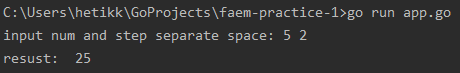

# FAEM Practice - 1

Данная программа позволяет пользователю возвести число в указанную степень

Вводится число и степень, в которую нужно это число возвести. 
При запуске программы выдается ответ, полученный возведением числа в степень.

Чтобы запустить программу нужно ввести команду `go run app.go` и ввести **два целых** числа через **пробел**, 
где первое число - основание, а второе - показатель

Пример: 

